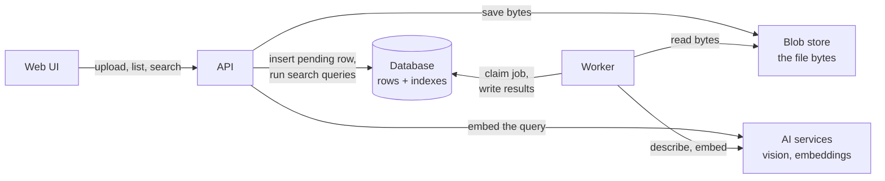
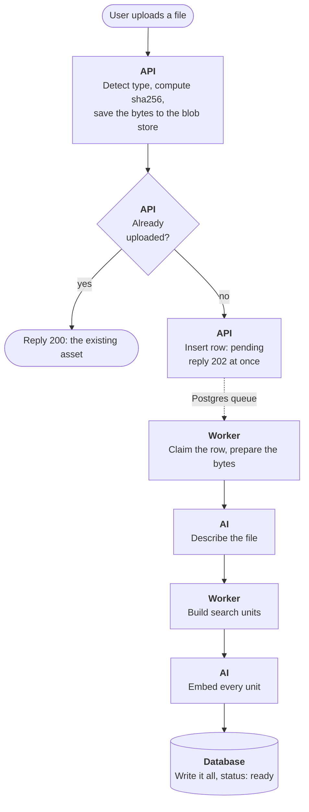
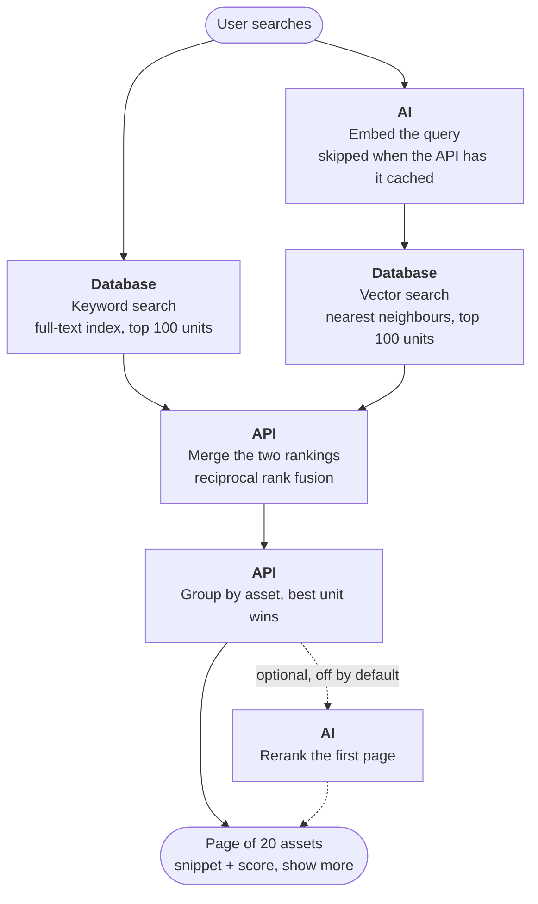

# Sift — Knowledge Management System

Sift lets you upload text files and images, then find them again by what
they contain: the literal words, what the content is about, and — for images —
what they look like. Every file is described by a vision model and embedded
into one shared vector space, and search combines keyword and meaning matches
into one ranked list.

**Docs:** [System design](docs/system-design.md) (every design choice, the
alternatives weighed, and what was deliberately left out — the source of
truth this README summarises) · [Test plan](docs/TESTING.md) ·
[API contract](docs/api-contract.md)

## Install and run locally

Needs [Docker](https://docs.docker.com/get-docker/) (running),
[uv](https://docs.astral.sh/uv/) and [Node](https://nodejs.org/). uv fetches
Python 3.13 and the backend packages on the first `make` command; the
frontend packages come from the `npm install` below.

```sh
cp backend/.env.example backend/.env   # every variable, with a comment
cd frontend && npm install && cd ..
make dev                               # Postgres, migrations, API on :8000, UI on :5173
```

By default `AI_PROVIDER=fake`: deterministic adapters that need no API keys
and cost no quota. Set `AI_PROVIDER=real` with `GEMINI_API_KEY` and
`VOYAGE_API_KEY` to use the real vendors. Other settings in `.env`:
`WORKER_THREADS` (default 4), `WORKER_ENABLED`, `BLOB_DIR`, `SEED_ON_START`.

| Command | What it does |
|---|---|
| `make test` | Unit and integration tests, fake adapters, separate `kms_test` database |
| `make test-live` | Adds the tests against the real vendors (needs both keys) |
| `make lint` | ruff for the backend, oxlint for the frontend |
| `make build` | Builds the SPA into the backend, then the container image |
| `docker compose --profile full up --build` | Runs the production container locally |
| `make seed` / `make matrix` | Ingests the demo files / runs the assignment's queries against them |

## Architecture



The API saves an upload and answers at once. The worker, running in the same
container, picks the file up from the Postgres queue, asks the AI services to
describe and embed it, and writes the result in one transaction. A search is
handled by the API alone: it embeds the query (or takes it from a cache), runs
the keyword and vector searches in the database, and merges the results.

### Upload pipeline



### Search pipeline



## What it does

- **Upload** a text file or an image. The upload returns at once; a
  background worker enriches the file (description, tags, visible text,
  embeddings) and it becomes searchable the moment its own processing
  finishes, independent of any other upload.
- **Search** runs two paths concurrently — keyword (Postgres full-text) and
  meaning (vector similarity) — and merges them with reciprocal rank fusion.
  Images are searchable through both their AI-written description and a
  vector computed directly from the pixels, so "black hair" and "brunette"
  both find the same photo, and "document" finds photos that contain one.
- The demo ships with a seeded set of files built to answer the assignment's
  example queries.

## How search works

Every asset becomes one or more **search units**: a metadata unit (title,
description, tags, visible text), one content unit per text chunk, and — for
images — an image unit embedded straight from the pixels. All vectors come from
one multimodal embedding model, so text, descriptions, images and the query
share a single vector space and one HNSW index. Search pulls the top 100 units
from each path, fuses the rankings in Python, groups by asset (best unit wins),
and returns pages of 20 with a "show more". No score threshold is applied:
recall is preferred over precision, so a weak match costs a glance and a real
match is never dropped.

## Stack

| Part | Choice |
|---|---|
| API + worker | Python (sync), one container, thread-pool worker |
| Web UI | React SPA served by the API |
| Database | Postgres + pgvector (HNSW, cosine) — also the job queue (`SKIP LOCKED` + `LISTEN/NOTIFY`) |
| Blob store | Local volume behind a `BlobStore` interface, files keyed by sha256 |
| Vision / summaries | Gemini Flash, structured JSON output |
| Embeddings | voyage-multimodal-3.5, 1024 dims |
| Migrations | Alembic, run at container start |
| Hosting | Railway (app + Postgres + volume) |

## Deliberately out of scope

The assignment asks for engineering approach, not production readiness. The
items below are things I would build into a production-grade, large-scale
version of this system as a matter of course — not as nice-to-haves. They are
left out here because of the time budget, and the code keeps the seam (an
interface, a flag, a stub, a column) where each one plugs in.

### Would be built in, left out for scope

- **Object storage for blobs.** The volume ties the system to one API
  instance. An S3-compatible `BlobStore` implementation is what allows
  horizontal scaling; the interface is already there.
- **Managed Postgres and, beyond tens of millions of vectors, a dedicated
  vector store.** The Railway-provisioned Postgres has no point-in-time
  recovery or failover. The listener needs a direct connection, not a
  transaction-mode pooler.
- **Worker scale-out.** The queue design (`FOR UPDATE SKIP LOCKED`) already
  supports many workers on many machines; scaling is `WORKER_THREADS` or more
  containers. An external broker only becomes necessary when the queue has to
  cross services.
- **Embedding-model migration.** Every vector records the model that made it
  and search filters on the current model, so a model switch degrades
  gracefully (old rows fall back to keyword search). The backfill job that
  re-embeds old rows is not written; in development, delete the collection
  and reseed.
- **Text-heavy images.** Images that are mostly text (dense document scans)
  lose small text at the ~1024 px the vision model receives. Production would
  branch on the `image_type` the model already returns and send document-like
  images through a full-resolution extraction pass or a dedicated OCR step
  behind the same adapter.
- **Large text files.** Files above the summary token budget are summarised
  from their head only. The `SummarySource` strategy has a `MapReduce`
  implementation as a stub; chunk units still carry full recall for the
  literal content, so only the topic-level summary degrades.
- **Typo tolerance on the keyword path.** The vector path absorbs common
  slips; the keyword path is exact after stemming. `pg_trgm` correction
  against a vocabulary table (built from `ts_stat`) is the planned addition.
- **Query expansion.** None at query time, by design: the vector path is the
  expansion, and rewrites cost 300–800 ms. For a domain-specific deployment,
  where every query maps onto a known set of questions, thesaurus
  dictionaries, multi-query/HyDE rewrites or ingest-time doc2query would be
  worth their cost.
- **Reranking.** A cross-encoder reranker (Voyage rerank-2.5) improves
  ordering but not recall and costs ~100–300 ms. The stage is pluggable with
  a no-op default; the implementation is behind a flag and is the last thing
  built, if time allows.

### Out of scope by the assignment

Authentication and authorisation, redundancy, rate limiting, production-grade
security, backups.

## Future enhancements

### Technology

- **Structured fields, not only prose.** The model writes a title, a
  description and tags. Fields such as people count, objects, colours and
  dates mentioned would turn into exact filters.
- **Two-pass enrichment.** A cheap model describes every file. A stronger model
  takes a second look only when the first answer looks weak (little text, image
  kind `other`, a document with almost no text read).
- **Measured prompt changes.** Each prompt version is scored against the query
  matrix (recall at 10), so a prompt change is a measured improvement, not a
  guess.
- **Contextual chunks.** The document's title and summary are added to each
  chunk before embedding, so a chunk that says "the defendant" still knows which
  case it comes from.
- **Query understanding.** One cheap model call splits "photos of Messi in
  Barcelona last season" into filters (person, place, dates) and free text.
- **Learning from use.** Which result a user opens for a query tunes the
  fusion, and later trains the reranker.
- **Near-duplicate grouping.** Burst shots and re-saved scans have different
  hashes. A perceptual hash folds them into one result.
- **A candidate pool that one large file cannot fill.** *Known limitation:*
  each search path keeps its best 100 *units* before they are grouped into
  assets, and a long text file has hundreds of chunks. For "black hair" the
  novel in the demo takes 92 keyword and 83 vector places, so a relevant photo
  or note can miss the results altogether; the effect grows with the
  collection. *The improvement,* in two levels:
  1. *A quota by unit kind.* Metadata, image and file-name units exist once per
     asset; only chunks multiply. Each path fills a separate quota for each
     group, so chunks can never push another asset's description out. Cheap:
     the same query run per group, on the same index.
  2. *A cap per asset* on what joins the pool (e.g. its top 3 units per path).
     Easy in the keyword path (a window function). In the vector path the index
     does not know about assets, so the cap needs a larger fetch first, and one
     dominant file can still fill that fetch; with step 1 in place this is only
     a safety net.

  The reranker, if it scores units rather than one snippet per asset, then
  reads at most units per asset × assets reranked (e.g. 3 × 20 = 60) texts:
  still one call. Fusion ranks change, so the query matrix is run before and
  after.

### Domain profiles

Today every collection is treated the same: one prompt, one schema, one
vocabulary. A client usually lives in a smaller world, such as a sports desk, a
law firm, a product catalogue, an insurer or a construction company. Knowing
that world improves every stage. A **domain profile** attached to a collection
holds that knowledge:

| Stage | What the profile adds |
|---|---|
| Describe | A domain paragraph in the prompt: what matters, which words to use |
| Schema | Extra structured fields, filled by the model |
| Known names | Lists the model picks from instead of guessing (roster, clients) |
| Keyword search | Domain synonyms and abbreviations |
| Rerank | Domain instructions for what a good result is |
| UI | Filters built from the structured fields |

Two examples:

```yaml
# Sports desk: mostly photos
prompt: >
  Photos from professional football matches. Identify players by jersey number
  and team kit, and name the moment (goal, celebration, foul, substitution,
  press conference).
fields:
  teams: list[str]
  players: list[str]            # from the roster, by jersey number
  moment: goal | celebration | foul | substitution | press_conference | other
  venue: str
known_names:
  roster: rosters/2026.csv      # team, number, name
  fixtures: fixtures/2026.csv   # the photo's date and place pick the match
synonyms: {pk: penalty kick, brace: two goals, hat-trick: three goals}
filters: [teams, players, moment]
```

```yaml
# Law firm: mostly scanned documents
prompt: >
  Legal documents. Name the document type and the parties exactly as written,
  and every date with what it refers to.
fields:
  document_type: contract | pleading | exhibit | correspondence | other
  parties: list[str]
  case_number: str | null
  date_signed: date | null
known_names:
  clients: clients.csv
synonyms: {nda: non-disclosure agreement, sow: statement of work}
keyword_mode: strict            # exact phrases matter more than meaning
filters: [document_type, parties, case_number]
```

**Why this fits the current design.** Each stage already has one place where a
profile plugs in. The prompt is built by one function that already appends
per-file context (the photo's date and place). The schema is a Pydantic model
sent with every call, and our code already adds fixed tags on top of the
model's answer. The prompt version is part of the recorded-response key, so a
changed profile never replays an old answer. Filters already run over the fused
list, and the reranker is an interface with a no-op default. What is missing is
small: somewhere to keep the profile (collections exist implicitly today, so a
`collections` table or one profile file per collection name) and a JSONB column
for the extra fields. The keyword index is fixed to Postgres's English
dictionary, so synonyms are simplest as query-time expansion. The engine stays
the same; each client gets a profile, not a fork.

## Exploration notes

- **Calibrated-decision models as the reranker.** TypeSafe's Jev
  (released Sept 2026) gives up text generation and returns typed decisions
  with *calibrated* probabilities in ~100 ms. Two things make it interesting
  here. First, the rerank stage takes (query, unit) pairs and returns an
  ordering — exactly a "score / judge" call, and Jev answers a whole page of
  units in one parallel query. Second, a calibrated relevance probability is
  the one thing this design lacks: cosine and RRF scores aren't calibrated,
  which is why I refused to draw a match/noise threshold. A number that
  actually means "70% relevant" would make that threshold honest.
  Text-only for now; early access; one vendor's benchmarks. Slot: the
  `Reranker` interface, behind the existing flag.
