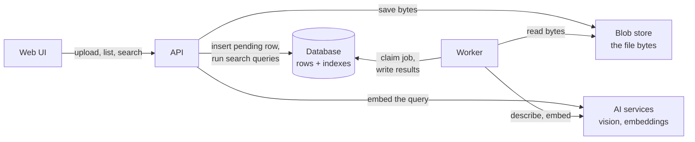
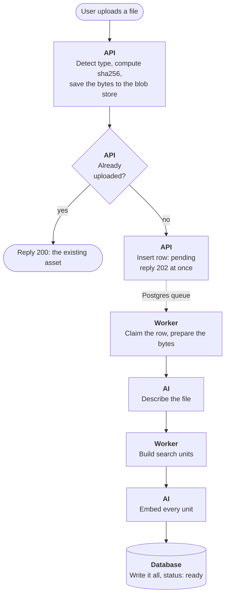
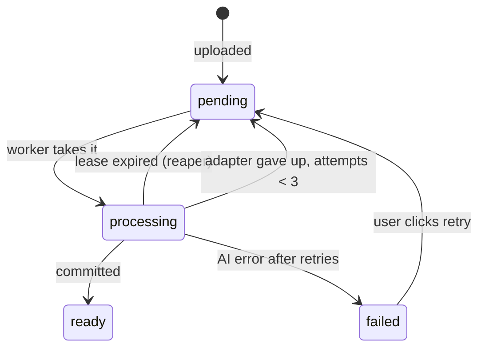
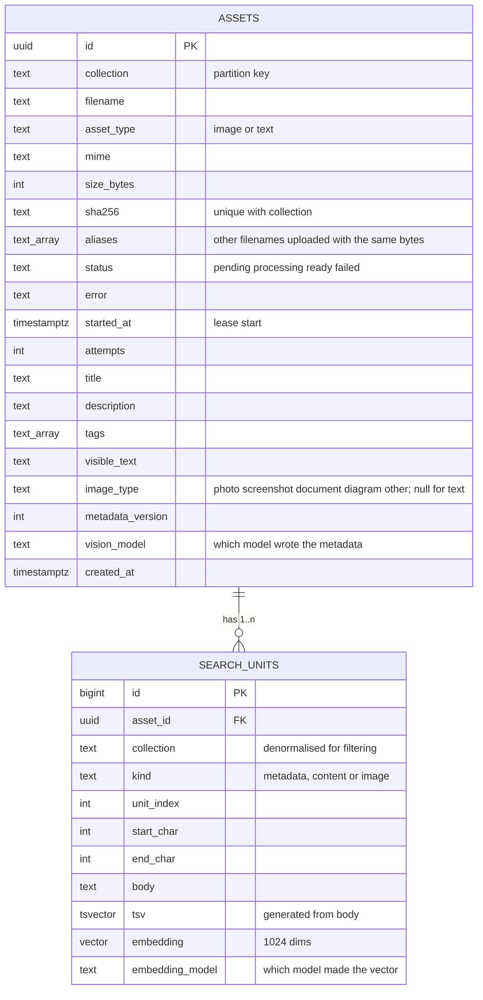
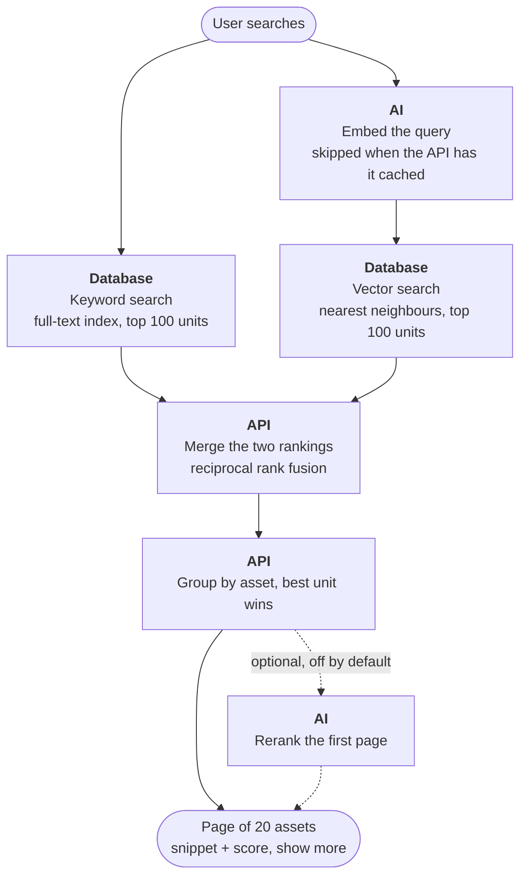

# Sift — System design

Sep 24, 2026 · @Michael

The design as it stands, with every choice made. Each section's Choice / Value table holds the decision and the alternatives weighed; the Scope section lists what is deliberately not built in this version.

## Components

Seven parts. Each arrow says what one part asks of another.

| Part | Job | Technology |
| --- | --- | --- |
| Web UI | Upload files, see them, search, manage collections | React SPA served by the API |
| API | Accept uploads, list assets, run searches | Python, sync |
| Blob store | Keep the raw file bytes | Local volume behind a `BlobStore` interface |
| Database | Asset rows, AI metadata, keyword index, vector index | Postgres + pgvector |
| Worker | Turn a saved file into a searchable asset | Same container, thread pool |
| AI services | Describe files, embed text and images, optionally rerank (off by default) | Hosted APIs behind adapters. Two vendors: Google (Gemini Flash) for vision and summaries; Voyage (multimodal-3.5, and its reranker if used) for embeddings. |
| Deployment | One container, one URL | Railway |

## Scope

Everything below this section is v1 unless it appears in one of these lists. Items here are not built now; the code carries the seam (a flag, an interface, a stub) and the README carries the note.

**Build only if time allows, in this order**

1. Reranker: the pluggable stage exists with a no-op; the Voyage implementation and its flag come last (#19).
2. pg\_trgm typo correction: vocabulary table from ts\_stat, trigram index, query-term correction before the keyword search (#23).

**Present as a stub, not implemented**

- Map-reduce summary source for text files above the token budget; whole-file and head are live (#10).

**README only: acknowledged, not built**

- Text-heavy images (dense document scans): a classifier keyed on `image_type` plus a full-resolution extraction pass, or a dedicated OCR step behind the same adapter (#13).
- Query expansion for domain-specific deployments: thesaurus dictionary, multi-query / HyDE rewrite, doc2query at ingest (#24).
- Head-only summary bias on files above the token budget (#10).
- Embedding-model backfill: vectors are tagged with the model that made them and the query filters on the current model; switching models in production means changing the config and running a backfill over rows with the old tag. In development, delete the collection and reseed (#16).

**README "how this scales": named paths, not built**

- S3-compatible `BlobStore`, which allows more than one API replica (#27).
- `PARTITION BY LIST (collection)` on `search_units` for per-collection indexes, then dedicated deployments for large or sensitive tenants (Storage, #28).
- Managed Postgres (RDS, Cloud SQL, Neon; direct connection for the listener), and beyond tens of millions of vectors a dedicated vector store (#15, #26).
- Worker scale-out via `WORKER_THREADS` or more containers; an external broker only when the queue crosses services (#2, #5).
- Model swaps behind the adapters: all-Google, or open-weight embedder and vision model on a GPU (#1, #7, #8).
- Result cache keyed on (collection, collection version, query, page) — safe by construction, small gain once query embeddings are cached; and Redis in place of the in-process caches when there is more than one API container (Search, Caching).

## Upload

The API saves the file and answers at once; the AI work happens later.

1. `POST /api/assets` receives one file (text or image, up to 10 MB) and a collection name.
2. Detect the type from the bytes, compute its sha256, write the bytes to the blob store.
3. Look up `(collection, sha256)`. On a hit: append the filename to `aliases` if it is new and reply `200 {id, status, deduplicated: true}`. The steps below are the miss path.
4. Insert an asset row with `status = pending` and, in the same transaction, `NOTIFY asset_pending`.
5. Reply `202 {id, status: pending}`.
6. The UI polls `GET /api/assets` every 2 s while it has pending uploads.

An asset is only visible in search once its status is `ready`.

## Processing

A worker takes one pending asset, runs the AI steps, and commits the result in one transaction.

What the worker does with one asset:

1. Claim it with `FOR UPDATE SKIP LOCKED`: set `status = processing`, `started_at = now()`, `attempts += 1`; commit.
2. Load the bytes. Image: fix rotation, downscale to \~1024 px. Text: decode UTF-8, split into chunks.
3. Ask the AI to describe it (see AI enrichment).
4. Build search units: one metadata unit per asset, plus one image unit per image (the pixels) and one content unit per text chunk.
5. Embed all units in one batched call to the multimodal embedder: text units as text, the image unit as pixels.
6. Write metadata, units and `status = ready` in one transaction.

| Choice | Value |
| --- | --- |
| How a worker finds pending work | Postgres is the queue: each worker thread claims one row with SELECT … WHERE status = 'pending' ORDER BY created\_at LIMIT 1 FOR UPDATE SKIP LOCKED, which lets any number of workers on any number of machines share the queue without coordination. Wake-up is LISTEN/NOTIFY: the upload transaction ends with NOTIFY asset\_pending (delivered on commit); the worker holds one dedicated listening connection and claims as soon as a notification arrives. A 1 s poll remains the guarantee, because notifications are fire-and-forget (lost if no listener is connected at that moment). Rules that keep it safe: wait with a timeout, listener connection in autocommit with a reconnect loop, and a direct connection rather than a transaction-mode pooler (PgBouncer in transaction mode does not deliver notifications). This is the pattern used by Graphile Worker, River and Oban. Alternatives weighed: an external broker (Celery/Redis, SQS — a second component and a second source of truth); polling only (up to 1 s latency to start); an in-process wake-up (works only while API and worker share a process). |
| What happens if a worker dies mid-job | Lease. The claim sets status = processing, started\_at = now(), attempts += 1 and commits, so no transaction is open during the AI calls. A reaper, on worker startup and every minute, resets rows with status = processing and started\_at older than the lease (10 min) back to pending. Results are written in one transaction with status = ready, so a crash leaves the asset either fully done or untouched — never partial. Alternative weighed: holding the FOR UPDATE transaction for the whole job (auto-rollback on crash, but pins a connection per job for the duration of every external call and blocks autovacuum — a known anti-pattern). |
| Retries on AI errors | Errors are classified. Transient (429, 5xx, timeouts, connection resets): the adapter retries in-thread with exponential backoff plus jitter, 3–4 attempts (\~1 s, 4 s, 16 s), honouring Retry-After; via the vendor SDKs' built-in retries or tenacity. Permanent (400, 413, 401/403, safety block): fail the call at once with the vendor's message. Outer loop: if the adapter gives up, the attempt is recorded and the asset returns to pending at once for another full pass; after attempts = 3 it becomes failed with the message in assets.error, and the UI retry button resets attempts and status. Two loops — short for blips inside the adapter, a full pass per attempt outside it — and a hard stop so a poison asset cannot loop forever. A lease that expires counts as an attempt too: the reaper fails an asset that has already used its three. Alternatives weighed: retry everything blindly (burns quota, hides bugs); no retries (rate limits are routine). |
| Jobs running at once | Configurable thread pool, default 4; each thread runs claim → process → commit independently. The work is I/O-bound (waiting on Gemini and Voyage), so threads are the right tool in sync Python; the bound is vendor rate limits and image-decoding memory. A batch of ten uploads becomes ten pending rows, four in flight at a time, and each becomes searchable the moment its own commit lands. Scaling is WORKER\_THREADS or a second container — SKIP LOCKED already coordinates them. Alternative weighed: one job at a time (a batch would serialise). |
| Same file uploaded twice | Idempotent by content hash. Unique index on assets.sha256; the blob store keys files by hash so bytes are stored once. A second upload of identical bytes returns the existing asset (200 {id, status, deduplicated: true}) and triggers no processing — a retried upload after a timeout is therefore safe. The lookup is the insert itself: INSERT … ON CONFLICT (collection, sha256) DO NOTHING RETURNING the row; no row back means a duplicate. Race: of two simultaneous uploads, Postgres makes the second insert wait for the first to commit, then it does nothing, and the handler fetches the existing row and returns it (D40). A duplicate arriving while the first is still pending returns that pending asset. Different filename, same bytes: the new name is appended to assets.aliases; responses carry filename + aliases, and the UI marks such results ("Found in: report.txt", hover: "This file is identical to: report\_final.txt, …") so the user is not confused when the hit shows the other name. Alternatives weighed: allow duplicates (double cost, duplicate results); reject with 409 (an error for a harmless action, breaks client retries). |

## AI enrichment

Search finds what the metadata says plus what the image vector captures, so this section still decides most of search quality.

Every asset gets the same fields, validated against a schema before they are stored. `image_type` is set for images only.

| Field | Image | Text file |
| --- | --- | --- |
| `title` | Short name for the scene | Short name for the document |
| `description` | 2–4 sentences: people and visible features (hair, clothing), objects, documents or screens, colours, setting | 2–4 sentence summary |
| `tags` | 10–20 lowercase words: objects, attributes, kind of image (photo, screenshot, document, diagram); plus the fixed type tags (below) | 5–15 topics and named entities; plus the fixed type tags (below) |
| `visible_text` | Every readable word in the image, verbatim | Not needed; the raw text is indexed |
| `image_type` | One of photo, screenshot, document, diagram, other — the model's own judgement of what kind of image it is. Stored so that a later document-specific path (out of scope now) can branch on it | Not applicable (null) |

Text files are also split into chunks so that a hit points at a place in the file.

| Choice | Value |
| --- | --- |
| Vision model for images | Gemini Flash, the older 3.x models for price (the Phase 1 spike found the 2.5 models refused to new keys); the ordered list is VISION\_MODELS, see the next row. Chosen for OCR quality, native document handling, JSON output and a context window large enough to summarise a whole text file in one call. Alternatives weighed: Claude Haiku 4.5, GPT-5.4 Mini (comparable at this tier); open-weight Qwen3-VL (needs a GPU). |
| Vision model under high demand | An ordered list of Gemini models (VISION\_MODELS). Every call starts at the first. A model that answers overloaded (503, or a 429 for that model's own quota) is skipped at once, with no backoff, and the next one is tried; backoff happens only after every model in the list has answered overloaded. Any other error fails the call at once, since it would fail on every model. The model that answered is stored in assets.vision\_model. Embeddings have no such list: vectors from two models are not comparable. Alternatives weighed: one model with backoff (waits out an outage another model would not have); remembering overloaded models for a cooldown (faster in an outage, but shared state across worker threads). |
| Embedding model | voyage-multimodal-3.5, 1024 dims, input\_type query/document. Single encoder for text and images (no CLIP modality gap), leads on visual retrieval while matching text-only models on text; fits pgvector's 2000-dim HNSW limit. Alternatives weighed: Cohere Embed v4 (near-equivalent, older), Gemini Embedding 2 (single-vendor route, 3072 dims), open-weight Jina v5-omni / SigLIP 2 (need a GPU; Jina is non-commercial). |
| One prompt per asset type, or one for both | Two prompts, one schema. A short shared preamble (produce search metadata, return only this JSON), then a type-specific body: the image prompt asks for visible features, objects, documents, colours, setting and verbatim visible text; the text prompt asks for a summary, topics and named entities. Both outputs are validated by the same schema model, so storage and search never know which prompt ran. Alternative weighed: one prompt with if-image/if-text branches — dilutes both sets of instructions. |
| Which part of a long text file the summary is made from | Whole file when it fits a configurable token budget (default \~200K tokens, \~800 KB of text, which Gemini Flash takes in one call); above that, the head only, up to the budget. Implemented as a summary-source strategy with three named implementations: whole-file (live), head (live fallback), map-reduce (stub — the intended path for very large files, left unimplemented to keep the first version simple). README states the head-only bias on huge files; their chunk units still carry recall for the literal content, so only the topic-level summary degrades. |
| Chunk size and overlap | Deliberately simple: fixed windows of 1,600 characters (\~400 tokens) with 240 characters (15%) of overlap, each window ending at its last space so no word is cut; both configurable. Chunk size is a retrieval decision, not a model limit (Voyage takes 32K), and short queries match focused chunks best. The chunker is there to give the system its structure (content units with character offsets); a recursive split on paragraph → sentence → word would keep chunks on natural boundaries and is the next step if retrieval on long files needs it (D46). Alternatives weighed: that recursive split (more code for a gain the demo collection does not show); semantic / late chunking (not mainstream). |
| How images become vectors (describe then embed text, or image embeddings) | Both. The vision model's description becomes a text metadata unit (keyword index + vector), and the pixels are embedded directly as a second image unit. Every vector in the system — text chunks, metadata units, image units and the query — comes from one multimodal embedding model (see #8), so there is a single vector space and the query is embedded once. Rejected: describe-then-embed alone (image recall capped by what the description says) and CLIP-only (no keyword path, weak on text inside images, biased in mixed text+image collections). |
| Where and when a photo was taken | The photo's own EXIF date taken and GPS position are read from the uploaded bytes and passed to the vision model as plain text next to the image (`Taken: 2026-08-11 14:32. Location: 51.5163, -0.1302`), with the instruction to use them only when they help describe the image: the model names the place and the time of day or season in the description and tags, which both search paths already cover. The model turns coordinates into a place name, so no geocoding service is needed. Only these two fields are sent; the rest of the EXIF (maker notes, thumbnails, serial numbers) is not. An image without them is described from its pixels alone. The stored original keeps all of its metadata; the copy sent to the vendors carries none. Alternatives weighed: new columns for date and position (a migration and a contract change, and GPS is unsearchable without a geocoding service; a structured date-taken column stays possible later if sorting or filtering by date becomes a feature); sending the raw EXIF (noise and tokens). Michael's addition (D45). |
| Text inside images: from the vision model, or a separate OCR step | The vision model, in the same call as the description: visible\_text is requested as complete and verbatim, with a generous output token limit. It adds only output tokens (well under a cent per image), whereas a separate OCR engine (Google Cloud Vision, Tesseract) would be a second step on top of the vision call, not instead of it. Known limitation, out of scope: images that are mostly text (dense document scans) lose small text at \~1024 px and would need their own handling (a document classifier and a full-resolution extraction pass, or a dedicated OCR step behind the same adapter). Acknowledged in the README. |
| What to do when the model returns invalid output | Four layers, cheapest first. (1) Constrain: the JSON schema is passed to Gemini as response\_schema so the decoder can only emit conforming JSON. (2) Validate anyway with a Pydantic model of the fields. (3) Normalise what can be fixed: lowercase and dedupe tags, strip, clamp list lengths, truncate over-long text. (4) One repair retry with the validation error appended to the prompt; if still invalid, treat as a permanent error for this attempt — it flows into the attempts counter and ends as failed with the validation message in assets.error. Alternatives weighed: regex-extracting JSON from free text (fragile); storing whichever fields parsed (silently loses visible\_text and hurts recall). |
| Finding an asset by its kind | A query that names a kind of asset finds assets of that kind even when nothing in their content mentions it: "picture" puts images at the top, "document" puts text files at the top, when no photo of a picture frame or of a document exists. Our code, not the model, adds fixed type tags to assets.tags from asset\_type and image\_type: every image gets image, picture; a photo also photo, photograph; a screenshot, screenshot; a document image, document, scan; a diagram, diagram, drawing; every text file gets text, text file, document. They are merged with the model's tags and deduped, so they reach both search paths through the metadata unit, and the UI shows them like any tag, which explains the match. An asset whose content really matches still ranks higher, since it matches on its description too. This is document-side expansion at ingest, like the tags themselves (D42). Alternatives weighed: type words in the search text only, hidden from the UI (a match with no visible reason); a query-side map from words to asset types (query expansion, rejected above for this system). |

## Storage

Two tables. Every asset becomes one or more search units, and search runs over that one table. Every row carries a collection: assets belong to a named collection, and the value is denormalised onto search units so both search paths filter with WHERE collection = $c and no join. Dedup is per collection (unique on collection + sha256); the blob is still stored once by hash. Collections are a partition key, not separate databases: the standard multi-tenant pattern (Pinecone namespaces, Qdrant payload filters, shared tables in Postgres SaaS). Scale path, in two steps: (1) PARTITION BY LIST (collection) on search\_units, which gives each collection its own HNSW and GIN index, partition pruning, and a detachable partition; (2) a dedicated deployment (own database, same container) for tenants whose size or sensitivity demands isolation. Alternative weighed: a database per collection from day one — turns "create a collection" into provisioning, multiplies indexes, pools, listeners and migrations by N, and forbids cross-collection search. Filtered vector search note: with pgvector ≥ 0.8 set hnsw.iterative\_scan = relaxed\_order so a selective collection filter still fills the limit.

An image has two units: a metadata unit (title + description + tags + visible text) and an image unit embedded straight from the pixels, with no body and no tsv. A text file has the metadata unit plus one content unit per chunk, with character offsets. Every vector comes from the same multimodal embedding model.

| Index | On | Serves |
| --- | --- | --- |
| B-tree | `assets(collection, status, created_at)`, `search_units(asset_id)` | Listing, filtering to ready, the worker's claim query, grouping hits by asset |
| Unique (B-tree) | `assets(collection, sha256)` | Dedup of identical bytes within a collection |
| Inverted (GIN) | `search_units.tsv` | Keyword search |
| Vector (HNSW, cosine) | `search_units.embedding` | Meaning search |

| Choice | Value |
| --- | --- |
| Vector index type (exact scan, HNSW, other) | HNSW with vector\_cosine\_ops, pgvector defaults m = 16, ef\_construction = 64; hnsw.ef\_search = 100 at query time (must be ≥ the units taken per path). Works from an empty table and grows incrementally; best recall per millisecond; query uses the matching operator (embedding <=> query). HNSW is approximate, so a meaning-only match can occasionally be skipped — exact text matches are unaffected because they arrive through the keyword path, which is exact. Alternatives weighed: exact scan (100% recall, latency grows with the collection); IVFFlat (needs existing data to train, lower recall). Scale-out beyond Postgres: a dedicated vector store (Qdrant, Pinecone) at tens of millions of vectors. |
| Record which embedding model made each vector | Yes: embedding\_model on search\_units, and the vector query filters on the current model. Vectors from different models are not comparable, so after a model switch old rows drop out of vector search (keyword search still finds them) until re-embedded. The backfill job that re-embeds rows with the old tag is deferred (see Scope); in development, delete the collection and reseed. assets.metadata\_version covers the prompt/schema side the same way. Alternative weighed: assume one global model and re-embed everything in a migration — works once, no gradual path. |
| How schema changes are applied | Alembic; alembic upgrade head runs at container start before the API accepts traffic. The pgvector extension, the HNSW index and the GIN index are explicit versioned migration steps. Alternatives weighed: ORM create\_all (creates, never alters); numbered SQL files with a schema\_migrations table. |

## Search

Every query runs twice, by keyword and by meaning; the two rankings are merged and grouped into a list of assets.

The keyword path finds exact words and IDs. The vector path finds meaning ("brunette" for "black hair"). A unit found by both outranks one found by either alone. Recall is preferred over precision: a missing file feels broken, an extra result costs a glance.

| Choice | Value |
| --- | --- |
| Units taken from each path | Configurable, default 100 units per path (for a page of 20 assets), with hnsw.ef\_search set to at least that number. An asset has several units, so candidates must outnumber the assets shown; a match that ranks low on one path and high on the other only gets its RRF boost if both lists are deep enough. Alternative weighed: page size per path — the naive choice, and how matches found by both paths get lost. |
| Rerank the merged top results with a second model, or not | Configurable, off by default. Reranking is a pluggable stage after fusion: a no-op implementation and a Voyage cross-encoder implementation (rerank-2.5) that rescores the first page of assets by their metadata-unit text. A cross-encoder reads query and unit together and orders far better than a cosine, but it only reorders — it never adds candidates, so it does nothing for recall — and it costs \~100–300 ms that cannot overlap with anything else. Kept as a flag so the effect can be measured on real queries. Low priority: implemented last, only if time allows. Alternatives weighed: always rerank (the RAG default, precision over latency); Cohere Rerank 4 as the vendor. |
| Where the cut between "match" and "noise" is drawn | No score cut. The only cuts are structural: 100 units per path and 100 assets per query. The keyword path is binary and never produces noise; the vector path's tail is weakly related, not wrong, and dropping it is the one failure the requirements forbid. Cosine values are not calibrated (short queries and paraphrases score low against everything) and RRF scores are rank sums with no notion of quality, so any fixed threshold drops real matches on exactly the queries that matter. The API exposes a normalised score (best-unit RRF score over the top score) so the UI may dim the tail; nothing is removed. Alternatives weighed: cosine threshold (common, uncalibrated); reranker-score threshold (needs the reranker on). |
| Assets returned per query | Page size 20 by default (configurable). The UI shows a 'show more' at the bottom of the results that loads the next page; capped at 100 assets per query, beyond which RRF ranks are noise and browsing belongs to the list endpoint. Alternative weighed: return everything above a score threshold (see the match/noise cut). |
| Merge in Python or in SQL | Python. The two paths are two SQL queries, each returning (unit\_id, asset\_id, rank), run concurrently so latency is the slower path rather than the sum; RRF, group-by-asset (best unit wins) and any reranking are pure Python functions; one final SQL fetch loads the asset rows by id. Alternative weighed: a single SQL statement with RRF in a CTE (the pgvector / Supabase pattern) — fewer round trips, but the paths run sequentially and the ranking logic is locked in SQL exactly where it will be tuned, tested and extended. |
| Typo tolerance | v1: none beyond what the vector path gives (subword tokenisation absorbs common slips). The keyword path is exact after stemming, so a typo there finds nothing. Kept for the last additions, if time allows: pg\_trgm correction — a vocabulary table built from the indexed lexemes (ts\_stat), trigram GIN index, each query term corrected to its nearest vocabulary word before the keyword search; a couple of ms, no external call. Alternatives weighed: trigram matching on unit bodies (does not scale); a dedicated engine with fuzzy matching (Elasticsearch, Meilisearch); LLM spell-correction at query time (latency). |
| Query expansion | None at query time. The vector path is the expansion ("brunette" finds "black hair" with no synonym list), and document-side expansion already happens at ingest through tags and description. Noted in the README as the natural upgrade for a domain-specific deployment, where every query maps onto a known set of questions and can be expanded against them (thesaurus dictionary, multi-query or HyDE rewrite, doc2query per chunk at ingest); this system is general-purpose, and query-time rewrites cost 300–800 ms. Alternatives weighed: Postgres thesaurus dictionaries (static), multi-query / HyDE (latency), doc2query (ingest-time). |
| Caching | Query-embedding cache: an in-process LRU (a few thousand entries) keyed on (embedding model, normalised query text) → vector. Search latency is dominated by the one external call, embedding the query (\~50–150 ms); the keyword path already runs concurrently with it, so a cache hit cuts the critical path to the vector lookup alone (\~10 ms). Deterministic, so never stale; the model name in the key covers model changes. Files: the blob is immutable by hash, so GET /api/assets/{id}/file sends ETag = sha256 and Cache-Control: public, max-age=31536000, immutable. Not built (see Scope): a (collection, query, page) → results cache — needs a per-collection version, bumped in the transaction that commits ready or deletes, in the cache key so entries expire on their own; saves \~10–20 ms once the embedding is cached. Redis replaces the in-process cache when there is more than one API container. Postgres's own buffer cache keeps hot index pages in memory with no work from us. |

## Deployment

One container runs the API, the UI and the worker; Postgres runs beside it. No auth, single instance, no redundancy for the demo, by the assignment; each section names its scale path.

| Choice | Value |
| --- | --- |
| Cloud provider | Railway. Deploys the Dockerfile from GitHub with HTTPS and logs; its Postgres template ships pgvector; DATABASE\_URL is a direct connection (LISTEN/NOTIFY works); a volume attaches to the service. Every constraint met with the least ceremony, on minimal compute for the demo. Alternatives weighed: Render (closest equivalent; free Postgres expires, disks need the paid tier); a Hetzner/DigitalOcean VPS with docker compose (cheapest, same compose file as dev, but you own TLS, backups and patching); GCP Cloud Run + Cloud SQL + GCS or AWS ECS + RDS + S3 (the production shape to migrate to; no persistent disk on Cloud Run, higher cost floor, IAM plumbing). |
| Postgres: managed service or a second container | Platform-provisioned Postgres with pgvector on Railway (a container the platform runs: no PITR or failover on the default tier, nothing to operate). Local development uses the pgvector/pgvector image as a second container in docker-compose.yml, so dev and prod run the same Postgres with the same extension. Scale path: a real managed Postgres (RDS, Cloud SQL, Neon) — using its direct connection string, not a transaction-mode pooler, for the listener. Alternatives weighed: managed Postgres from day one (cost floor, more setup); Postgres inside the app container (one crash takes both). |
| Where the blob volume lives | A Railway volume mounted at /data, behind the BlobStore interface, files keyed by sha256; the API streams files to the UI (GET /api/assets/{id}/file), so the backend is invisible to clients. Known limitation: a volume belongs to one container instance, which is what blocks a second API replica — the reason the interface exists. Named next step: an S3-compatible BlobStore (S3, GCS, Cloudflare R2), which unblocks horizontal scaling. Alternatives weighed: object storage from day one (correct at scale, one more bucket and credential for the demo); bytes in Postgres (bytea) — wrong tool for 10 MB files. |
| Seed data loaded on first start | Collections. Every asset belongs to a named collection; upload, list and search take a collection parameter, and the UI has a collection selector (names with asset counts) with "+ New collection" (created empty on first use — just a new column value) and "Delete collection" (with confirm). Seed data lives in seed/\<collection-name>/ folders, one per collection, ingested through the normal upload path when SEED\_ON\_START=true (default on for the deployed demo, off locally) or via make seed; reseeding is a no-op thanks to content-hash dedup. The demo collection (\~30 files) is built to prove the assignment's example queries and their paraphrases: people with black, blond and brown hair; photos containing documents, receipts or screens; a screenshot with visible text; a diagram; text files that mention "black hair" or "document" literally and others that only imply them; a seed README lists the files and the queries they answer. The interviewer starts from scratch by creating a new collection. Alternatives weighed: no seed (empty first impression); SQL fixtures with pre-computed vectors (stale on any prompt or model change, hides the pipeline). |
